# X-Talent Frontend — RWD 測試報告

> **測試日期：** 2026-03-20（第一輪）/ 2026-03-20（第二輪驗收 C 方案）
> **修復日期：** 2026-03-20
> **測試工具：** Playwright (MCP)
> **測試帳號：** testing_mentee@xchange.com.tw
> **截圖位置：** `reports/screenshots/`
> **測試狀態：** 全部完成 ✅
> **修復狀態：** 問題 1-8 全部 ✅ 已修復（含第二輪新發現問題 8）

---

## 測試涵蓋範圍

### 頁面 × 螢幕尺寸

| 頁面                               | Desktop<br>1440px | Tablet Portrait<br>768px | Tablet Landscape<br>1024px | Mobile Portrait<br>375px | Mobile Landscape<br>812px |
| ---------------------------------- | :---------------: | :----------------------: | :------------------------: | :----------------------: | :-----------------------: |
| `/` 首頁                           |        ✅         |            ✅            |             ✅             |            ✅            |            ✅             |
| `/about`                           |        ✅         |            ✅            |             ✅             |            ✅            |            ✅             |
| `/mentor-pool`                     |        ✅         |            ✅            |             ✅             |            ✅            |            ✅             |
| `/auth/signin`                     |        ✅         |            ✅            |             ✅             |            ✅            |            ✅             |
| `/auth/signup`                     |        ✅         |            ✅            |             ✅             |            ✅            |            ✅             |
| `/auth/password-forgot`            |        ✅         |            ✅            |             ✅             |            ✅            |            ✅             |
| `/auth/email-verify`               |   ✅（修復後）    |            ✅            |             ✅             |            ✅            |            ✅             |
| `/auth/onboarding`                 |    代碼審查 ✅    |            —             |             —              |            —             |             —             |
| Header（登入後）                   |        ✅         |            ✅            |             ✅             |            ✅            |            ✅             |
| `/profile` 個人資料頁              |        ✅         |            ✅            |             ✅             |            ✅            |            ✅             |
| `/profile/edit` 編輯個人資料       |        ✅         |            ✅            |             ✅             |            ✅            |            ✅             |
| `/reservation/mentor` 導師預約管理 |        ✅         |            ✅            |             ✅             |            ✅            |            ✅             |
| `/reservation/mentee` 我的預約     |        ✅         |            ✅            |             ✅             |            ✅            |            ✅             |

### 互動元件

| 元件                                                 | Desktop 1440px | Tablet Portrait 768px | Tablet Landscape 1024px | Mobile Portrait 375px | Mobile Landscape 812px |
| ---------------------------------------------------- | :------------: | :-------------------: | :---------------------: | :-------------------: | :--------------------: |
| Header — 完整 Nav                                    |       ✅       |          ✅           |           ✅            |          N/A          |           ✅           |
| Header — 漢堡選單                                    |      N/A       |          N/A          |           N/A           |          ✅           |          N/A           |
| Header — User avatar dropdown（登入後）              |       ✅       |          N/A          |           N/A           |          N/A          |          N/A           |
| Header — Mobile account menu（登入後）               |      N/A       |          N/A          |           N/A           |          ✅           |          N/A           |
| Mentor Pool — 篩選面板                               |       ✅       |          ✅           |           ✅            |          ✅           |           ✅           |
| SignIn — 表單驗證訊息                                |       ✅       |          ✅           |           ✅            |          ✅           |           ✅           |
| Reservation — 分頁切換（即將到來/等待回復/歷史紀錄） |       ✅       |          ✅           |           ✅            |          ✅           |           ✅           |

---

## 發現的問題

### ✅ 問題 1 — Mentor Pool 篩選面板在小螢幕溢出 viewport（已修復）

**影響頁面：** `/mentor-pool`
**影響尺寸：** Mobile Portrait (375px)、Mobile Landscape (812px)、Tablet Landscape (1024px)、Desktop 1440x900

**現象：**
篩選面板包含 5 個下拉 (Position / Skill / Topic / Expertise / Industry) + 套用/清除按鈕，總高度超過小螢幕 viewport。面板沒有 `max-height` 及 `overflow-y: auto`：

| 尺寸                    | 原狀況                 | 修復後                    |
| ----------------------- | ---------------------- | ------------------------- |
| Mobile Portrait 375px   | Position 完全看不到    | ✅ 可捲動，按鈕固定底部   |
| Tablet Landscape 1024px | Position、Skill 被截掉 | ✅ 可捲動，按鈕固定底部   |
| Mobile Landscape 812px  | Topic 以後全被截掉     | ✅ 可捲動，按鈕固定底部   |
| Desktop 1440x900        | 套用按鈕被截掉         | ✅ 按鈕固定底部，永遠可見 |

**修復方式（`src/components/filter/MentorFilterDropdown.tsx`）：**

1. `Popover.Content` 改為 `flex flex-col` + `max-h-[calc(var(--radix-popover-content-available-height)-8px)]` + `collisionPadding={8}`
2. Selects 區域加 `overflow-y-auto`，buttons 獨立在底部（加 `border-t` 分隔線）
3. `Popover.Content` z-index `z-20` → `z-[55]`（高於 header 的 `z-50`）
4. `FilterSelect.tsx` 的 `SelectContent` z-index `z-30` → `z-[60]`（options list 不被 header 蓋住）

**修復前後截圖對比：**

| 修復前（Desktop）                                     | 修復後（Desktop）                               |
| ----------------------------------------------------- | ----------------------------------------------- |
| 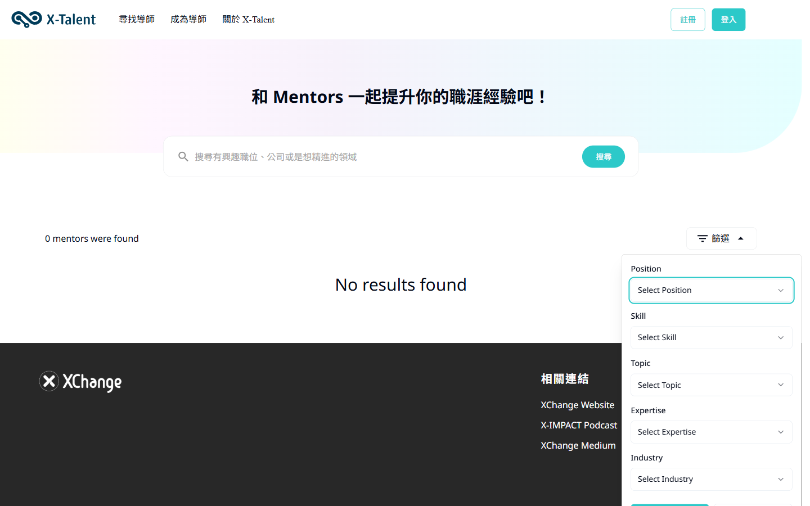 | 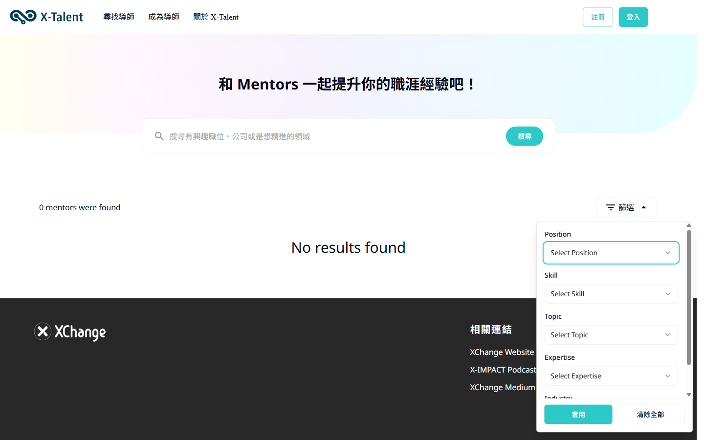 |

| 修復後 Mobile 375px                           | 修復後 Mobile Landscape                          | 修復後 Tablet Landscape                          |
| --------------------------------------------- | ------------------------------------------------ | ------------------------------------------------ |
| 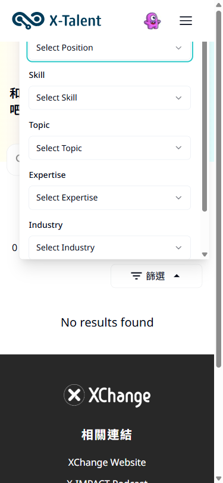 | 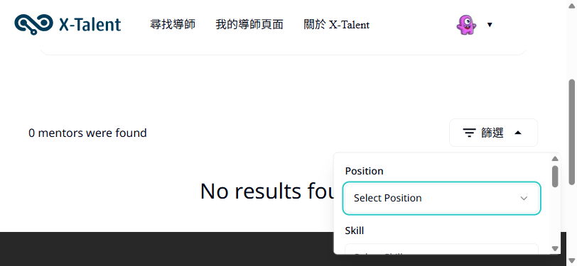 | 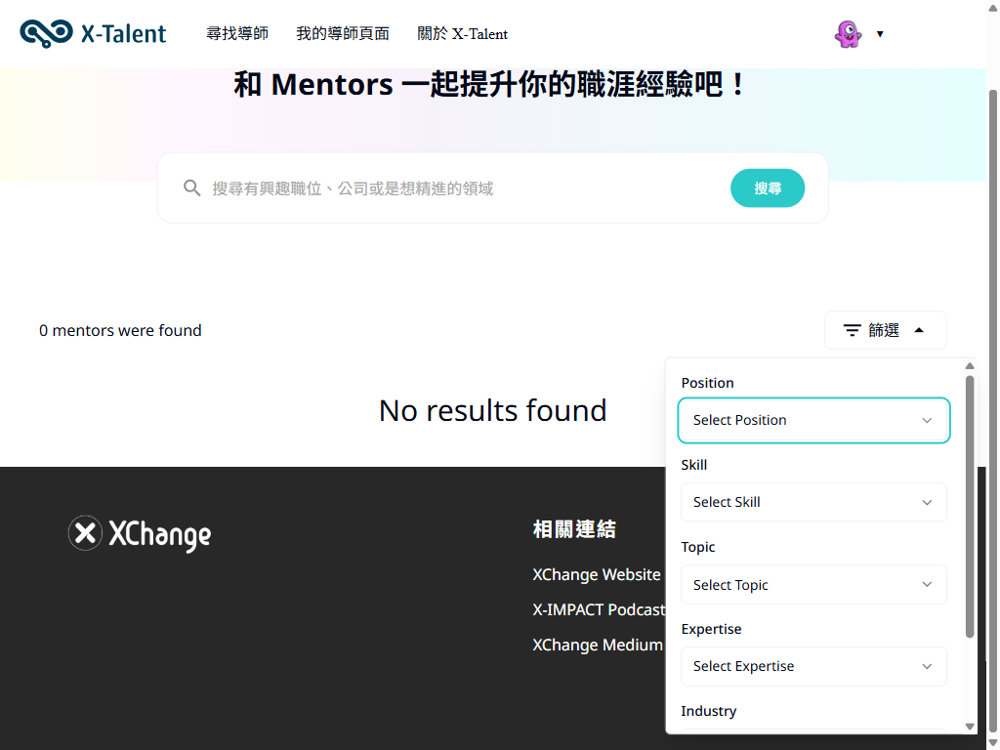 |

---

### ✅ 問題 2 — SignIn / SignUp 在 Tablet Portrait & Mobile Portrait 有大量空白（已修復）

**影響頁面：** `/auth/signin`、`/auth/signup`
**影響尺寸：** Tablet Portrait (768px)、Mobile Portrait (375px)

**現象：**
Desktop 採左欄表單 + 右欄圖片的兩欄佈局，在 768px 和 375px 時右欄圖片被隱藏，但 layout 容器的 `min-h-[calc(100vh-70px)]` 在所有尺寸都生效，造成表單下方與 footer 之間出現大塊空白。

| 尺寸                    | 原狀況      | 修復後      |
| ----------------------- | ----------- | ----------- |
| Desktop 1440px          | ✅ 兩欄並排 | ✅ 不受影響 |
| Tablet Landscape 1024px | ✅ 兩欄並排 | ✅ 不受影響 |
| Mobile Landscape 812px  | ✅ 正常     | ✅ 不受影響 |
| Tablet Portrait 768px   | ❌ 大量空白 | ✅ 空白消除 |
| Mobile Portrait 375px   | ❌ 大量空白 | ✅ 空白消除 |

**修復方式（`src/app/auth/(sign)/layout.tsx`）：**
移除 `min-h-[calc(100vh-70px)]`（原本在所有尺寸都生效），改為僅保留 `lg:min-h-[720px]`，讓小螢幕單欄模式自動縮至內容高度。

```diff
- <div className="flex min-h-[calc(100vh-70px)] lg:min-h-[720px]">
+ <div className="flex lg:min-h-[720px]">
```

**修復前後截圖對比：**

| 修復前 Tablet Portrait                   | 修復後 Tablet Portrait                      |
| ---------------------------------------- | ------------------------------------------- |
| 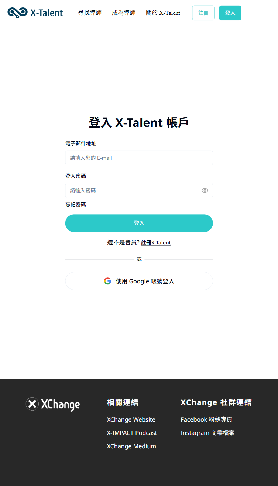 | 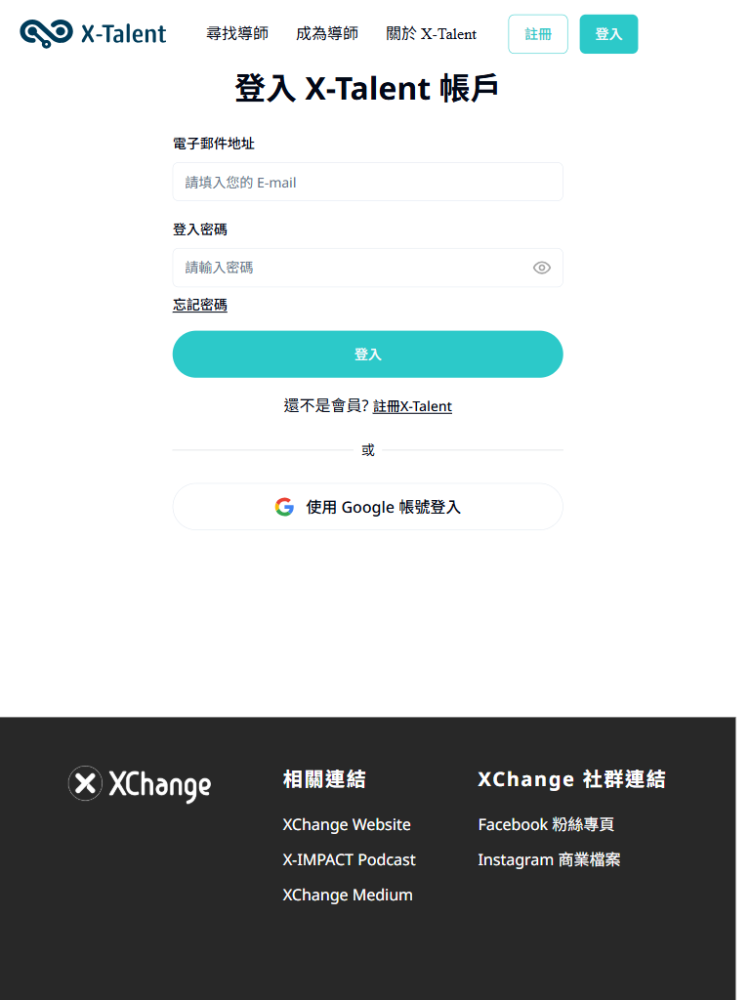 |

| 修復後 Mobile Portrait (SignIn)        | 修復後 Mobile Portrait (SignUp)        |
| -------------------------------------- | -------------------------------------- |
|  | 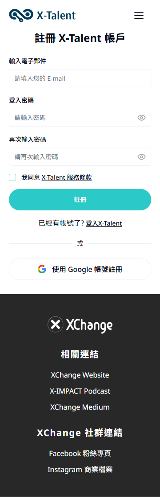 |

Desktop 兩欄版型確認無影響：

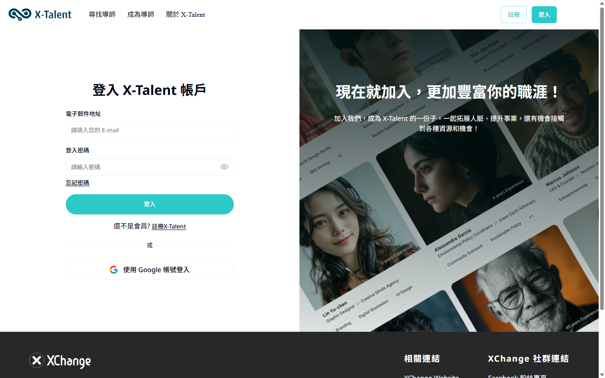

---

### 🟡 問題 3 — About 頁面在 Tablet Landscape (1024px) 段落文字無邊距

**影響頁面：** `/about`
**影響尺寸：** Tablet Landscape (1024px)

**現象：**
「X-Talent 的起心動念」段落文字及「X-Talent 的核心價值」說明文字，在 1024px 時直接貼齊螢幕左右邊緣，沒有 padding，可讀性差。

**截圖：**

Tablet Landscape 文字貼邊（問題）：

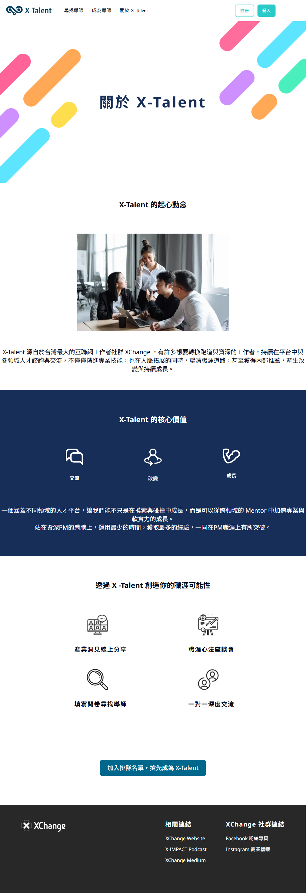

Desktop 正常對比：

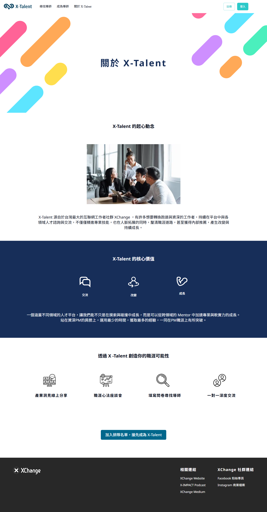

**建議修法：**
檢查這些段落的容器在 `lg:` breakpoint 是否缺少水平 `px` padding 或 `max-width` 限制。

---

### 🟡 問題 4 — 首頁 Testimonial 輪播在 Tablet Landscape (1024px) 文字被截斷

**影響頁面：** `/`（首頁）
**影響尺寸：** Tablet Landscape (1024px)

**現象：**
Testimonial 輪播區塊的左側文字內容在 1024px 時超出容器邊界，部分文字被截掉。

**截圖：**

Tablet Landscape 文字溢出截斷（問題）：

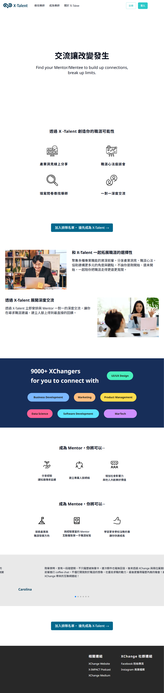

**建議修法：**
檢查 testimonial 容器在 1024px 的寬度計算，或確認 `overflow: hidden` 是否誤截內容。

---

### 🟡 問題 5 — 漢堡選單缺少 `DialogTitle`（Accessibility 違規）

**影響頁面：** 全站 Header
**影響尺寸：** Mobile Portrait (375px)，漢堡選單展開時

**現象：**
Console 出現錯誤：

```
DialogContent requires a DialogTitle for the component to be accessible
```

另外，選單展開後 dialog 內的 logo 圖片未顯示。

**截圖：**

漢堡選單展開（logo 未顯示，無 DialogTitle）：

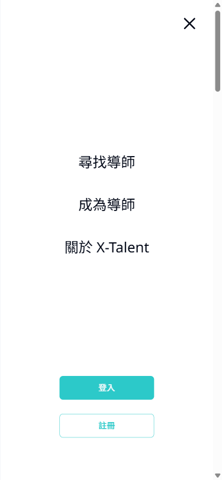

**建議修法：**
在漢堡選單的 `DialogContent` 內加入：

```tsx
<DialogTitle className="sr-only">導航選單</DialogTitle>
```

---

## 正常確認截圖

### 首頁

| Desktop 1440px                    | Tablet Portrait 768px            | Mobile Portrait 375px            |
| --------------------------------- | -------------------------------- | -------------------------------- |
| 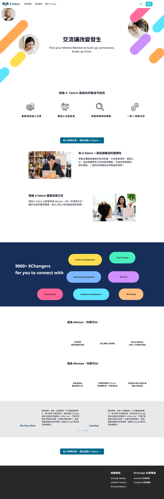 | 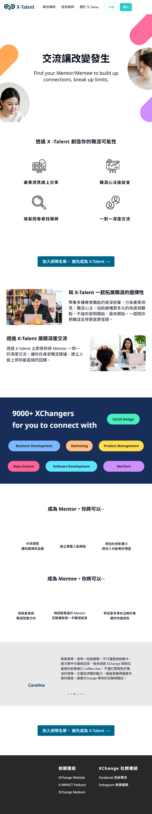 | 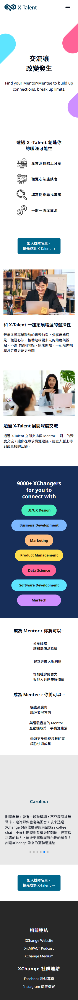 |

### About

| Desktop 1440px                     | Tablet Portrait 768px             | Mobile Portrait 375px             |
| ---------------------------------- | --------------------------------- | --------------------------------- |
|  | 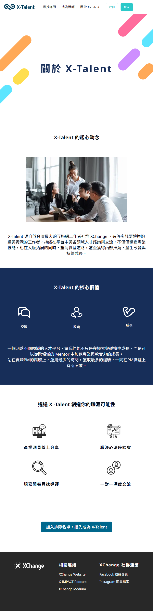 | 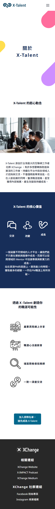 |

### Mentor Pool

| Desktop 1440px                           | Tablet Portrait 768px                   | Mobile Portrait 375px                   |
| ---------------------------------------- | --------------------------------------- | --------------------------------------- |
| 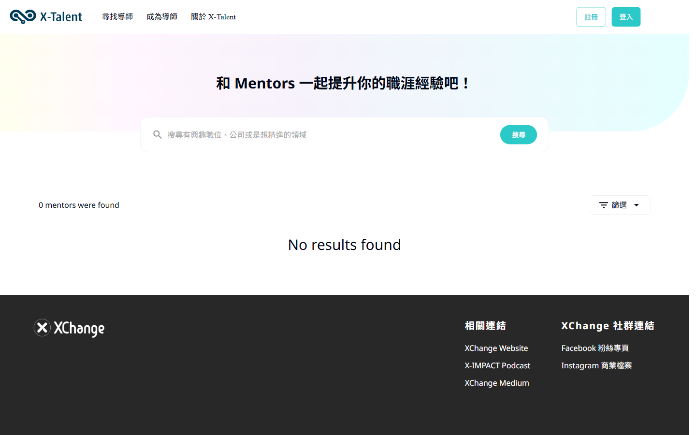 | 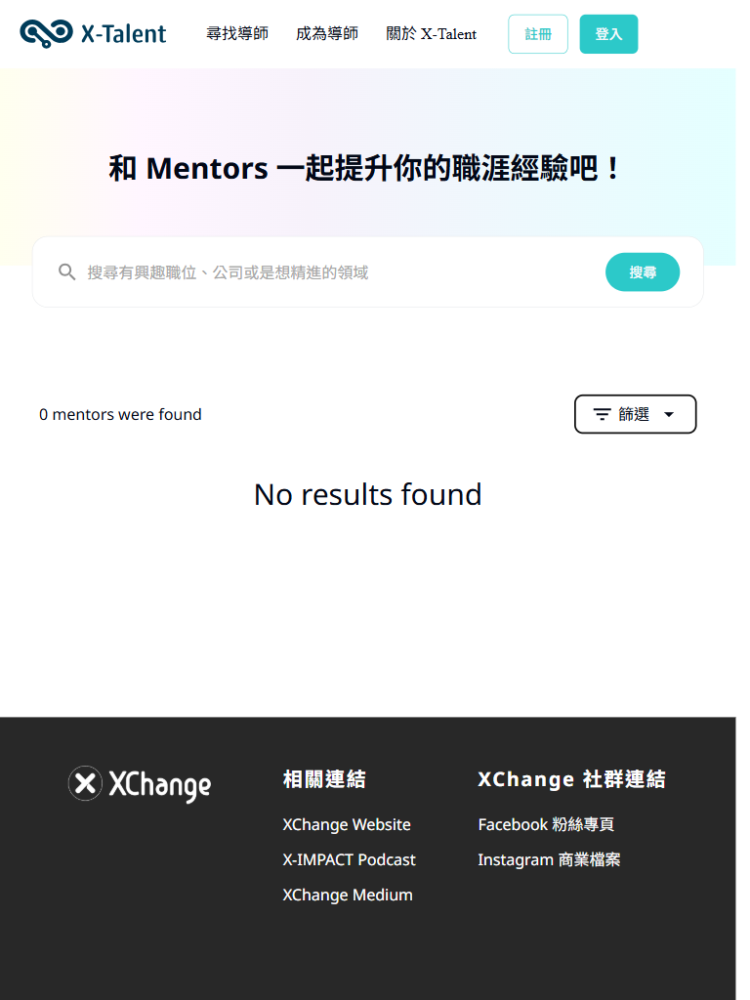 | 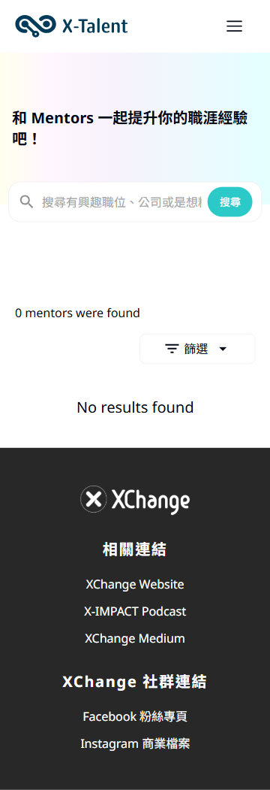 |

### SignIn — 各尺寸

| Desktop                             | Tablet Landscape                             | Mobile Landscape                             |
| ----------------------------------- | -------------------------------------------- | -------------------------------------------- |
| 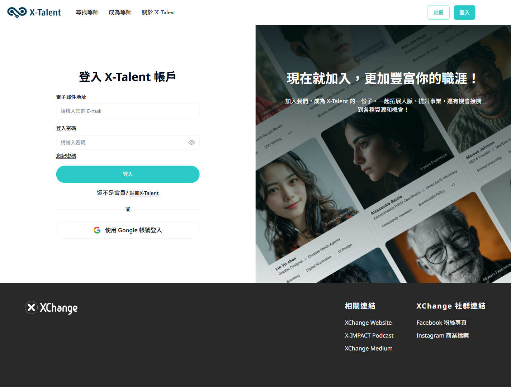 |  | 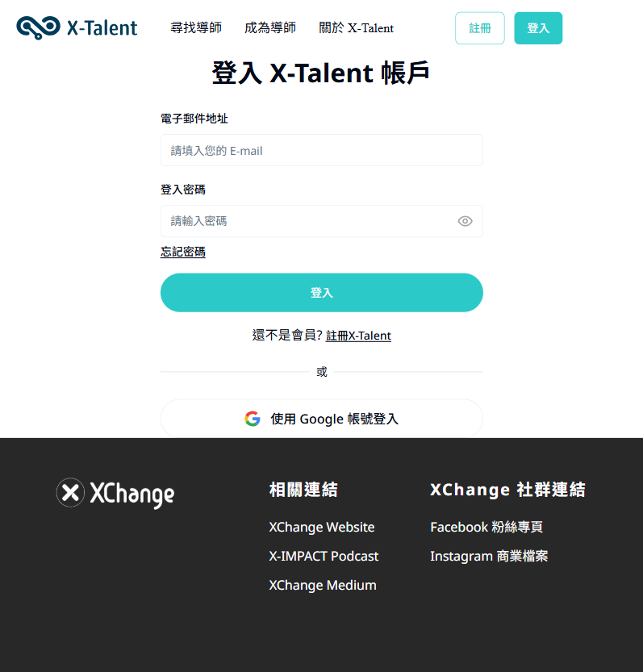 |

### SignIn — 表單驗證 Error State

| Mobile Portrait                               | Mobile Landscape                                 |
| --------------------------------------------- | ------------------------------------------------ |
| 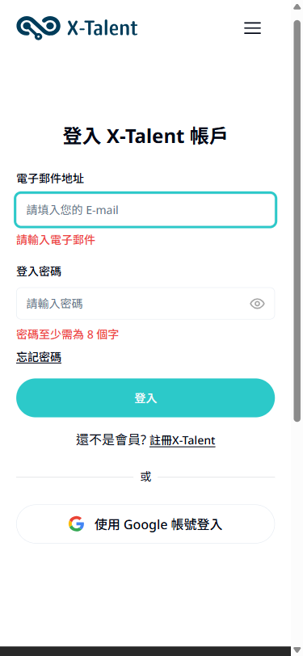 | 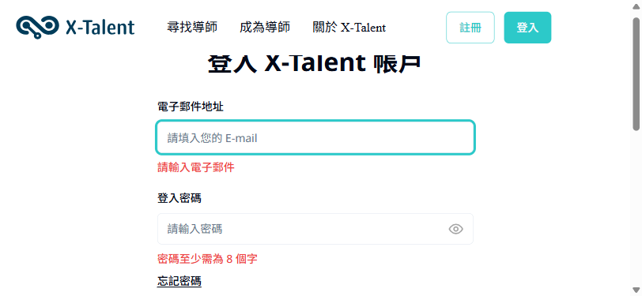 |

### SignUp — 各尺寸

| Desktop                             | Tablet Landscape                             | Mobile Portrait                    | Mobile Landscape                             |
| ----------------------------------- | -------------------------------------------- | ---------------------------------- | -------------------------------------------- |
| 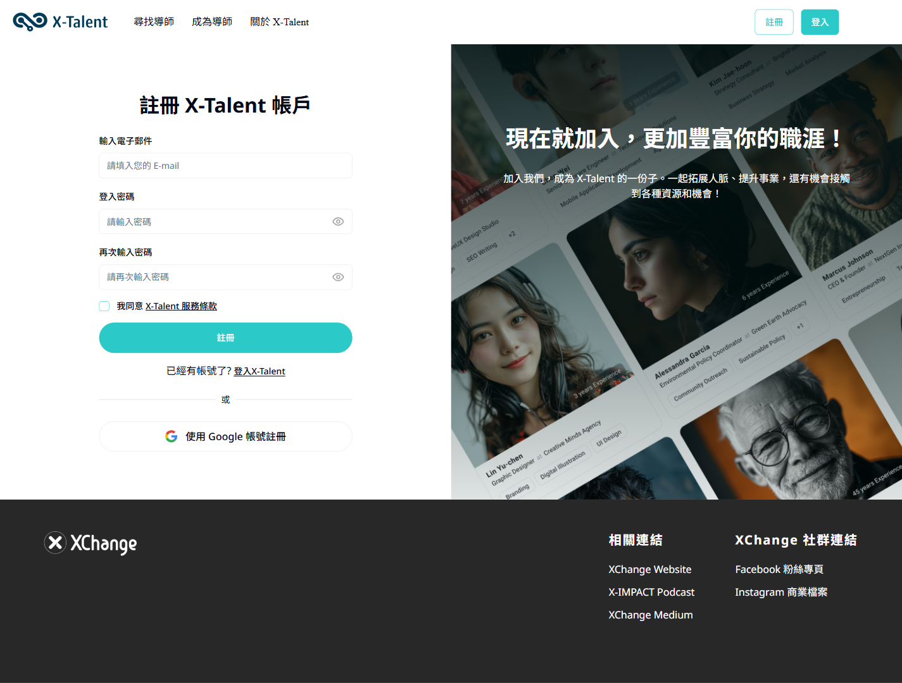 |  | 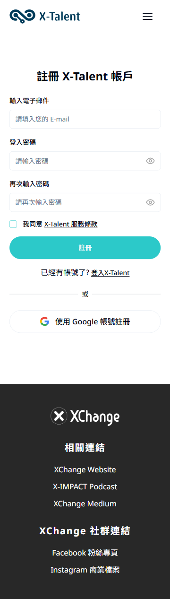 | 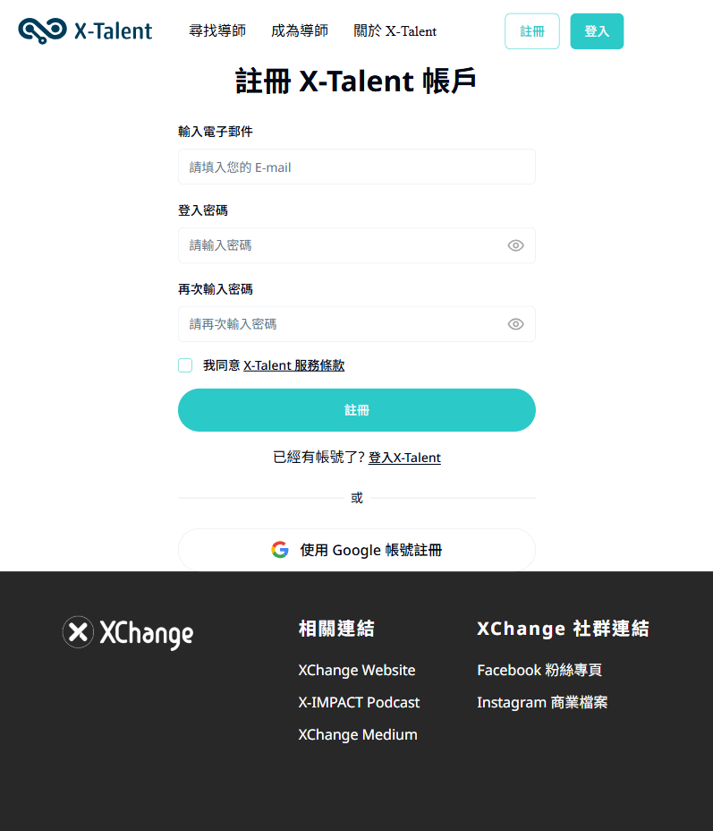 |

---

## 登入後頁面測試結果 ✅

> **測試帳號：** testing_mentee@xchange.com.tw（角色：Mentor）

### 頁面 × 螢幕尺寸

| 頁面                  | Desktop<br>1440px | Tablet Portrait<br>768px | Tablet Landscape<br>1024px | Mobile Portrait<br>375px | Mobile Landscape<br>812px |
| --------------------- | :---------------: | :----------------------: | :------------------------: | :----------------------: | :-----------------------: |
| Header（登入後）      |        ✅         |            ✅            |             ✅             |            ✅            |            ✅             |
| `/profile` 個人資料頁 |        ✅         |            ✅            |             ✅             |            ⚠️            |            ✅             |

### 互動元件（登入後）

| 元件                                     | Desktop 1440px | Mobile Portrait 375px |
| ---------------------------------------- | :------------: | :-------------------: |
| Header — User avatar dropdown            |       ✅       |          N/A          |
| Header — Mobile account menu dialog      |      N/A       |          ✅           |
| Header — Mobile hamburger menu（登入後） |      N/A       |          ✅           |

---

### 登入後 Header — Desktop Avatar Dropdown

下拉選單正常展開，包含：

- 用戶頭像 + 用戶名（顯示截斷：`Mentor12345...`）
- 分享個人頁面
- 導師預約管理
- 我的預約
- 登出

| Desktop Dropdown 展開                                  |
| ------------------------------------------------------ |
| 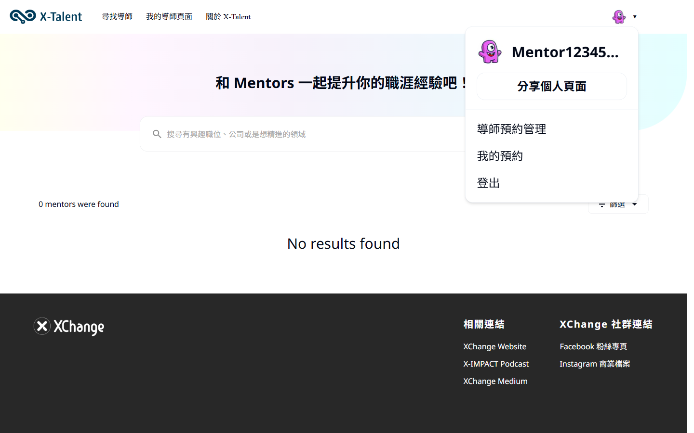 |

---

### 登入後 Header — Mobile

Mobile 版 Header 登入後分為兩個獨立按鈕：

1. **Avatar 按鈕**（`Open account menu`）— 開啟帳戶 Dialog，含完整 account 操作
2. **漢堡按鈕**（`Open menu`）— 只含導航連結（尋找導師、我的導師頁面、關於 X-Talent）

**Account Dialog 選項：** 頭像 + 用戶名、分享個人頁面、導師預約管理、我的預約、登出

| Mobile Header（登入後）                      | Mobile Account Menu Dialog                         |
| -------------------------------------------- | -------------------------------------------------- |
| 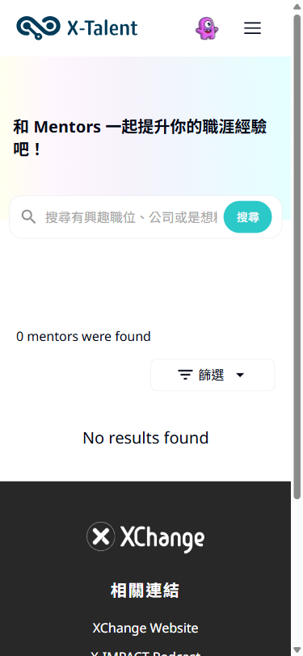 | 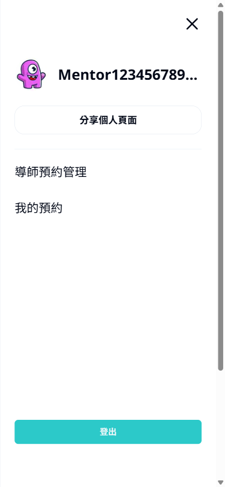 |

| Mobile Hamburger（登入後）                      |
| ----------------------------------------------- |
| 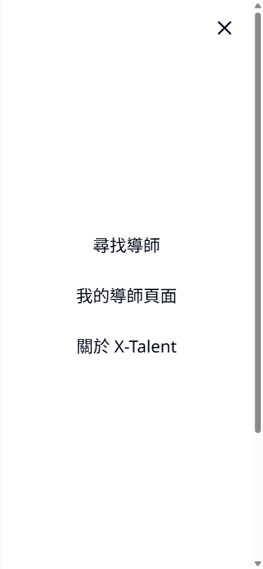 |

> ⚠️ **注意：** Mobile account menu 和 hamburger 皆使用 Dialog，皆有 `DialogTitle` 缺失問題（與問題 5 相同）。Logo 在 dialog 內不顯示。

---

### `/profile` 個人資料頁

Profile 頁面包含：Hero 區（頭像、名稱、職稱、LinkedIn 連結、編輯按鈕）+ 左欄個人資訊 + 右欄預約日曆。

| Desktop 1440px                       | Tablet Portrait 768px               |
| ------------------------------------ | ----------------------------------- |
| 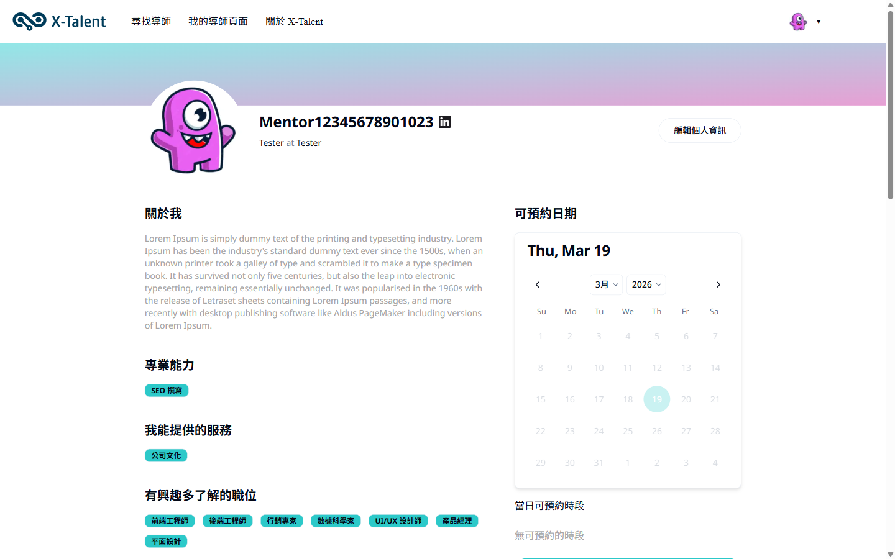 | 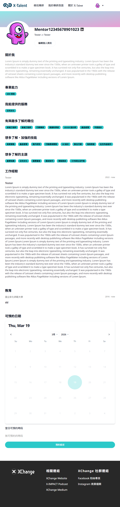 |

| Tablet Landscape 1024px                       | Mobile Portrait 375px               | Mobile Landscape 812px                        |
| --------------------------------------------- | ----------------------------------- | --------------------------------------------- |
| 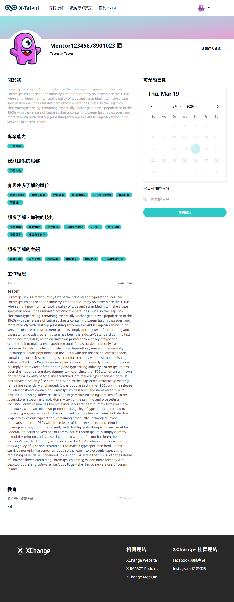 |  | 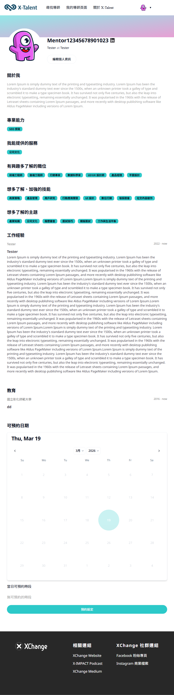 |

---

### ✅ 問題 3 — About 頁面 1024px 文字貼邊（已修復）

**影響頁面：** `/about`
**影響尺寸：** Tablet Landscape (1024px)

**現象：**
「X-Talent 的核心價值」段落在 `lg:` breakpoint 套用 `lg:px-0`，移除所有側邊 padding，導致文字貼至螢幕邊緣。

**修復方式：**
移除 `lg:px-0`，讓 `px-8` 在所有尺寸生效，保持一致的水平留白。

**修改檔案：**

- `src/app/(landing)/about/page.tsx`
  - `className="px-8 text-center text-base md:text-xl lg:px-0"` → `className="px-8 text-center text-base md:text-xl"`

---

### ✅ 問題 4 — 首頁 Testimonial 輪播文字截斷（已修復）

**影響頁面：** `/`
**影響尺寸：** Tablet Landscape (1024px)

**現象：**
`HomePageSlider` 中評價文字段落設為 `flex-initial`（`flex-grow: 0`），在部分尺寸下無法填滿 flex 空間，造成文字被裁切或排版異常。

**修復方式：**
將段落改為 `flex-1 min-w-0`，使其填滿 flex 容器剩餘空間並能正常換行。

**修改檔案：**

- `src/components/landing/HomePageSlider.tsx`
  - `<p className="flex-initial">` → `<p className="min-w-0 flex-1">`

---

### ✅ 問題 5 — 漢堡選單 / Account Sheet 缺少無障礙標題（已修復）

**影響頁面：** 全站 Header
**影響尺寸：** Mobile Portrait (375px)

**現象：**
`HamburgerMenu` 和 `MobileUserMenu` 使用 Radix `Sheet`（底層為 Dialog），但未提供 `DialogTitle`，導致螢幕閱讀器無標題可讀，並在開發工具中出現 accessibility 警告。

**修復方式：**
在各 `SheetContent` 內加入 `<SheetTitle className="sr-only">`，標題對視覺隱藏但對 AT 可見。

**修改檔案：**

- `src/components/layout/Header/HamburgerMenu.tsx`
  - 匯入 `SheetTitle`；在 `SheetContent` 內加 `<SheetTitle className="sr-only">導航選單</SheetTitle>`
- `src/components/layout/Header/MobileUserMenu.tsx`
  - 匯入 `SheetTitle`；在 `SheetContent` 內加 `<SheetTitle className="sr-only">用戶選單</SheetTitle>`

---

### ✅ 問題 6 — Profile 頁面 Mobile Portrait (375px) 用戶名溢出（已修復）

**影響頁面：** `/profile`
**影響尺寸：** Mobile Portrait (375px)

**現象：**
Hero 區塊的用戶名稱（`Mentor12345678901023`）加上 LinkedIn 圖示在 375px 時超出容器寬度，造成水平溢出。

**修復方式：**
在文字容器加上 `min-w-0`，並在用戶名段落加上 `break-words`，讓長名稱自動換行而非溢出。

**修改檔案：**

- `src/app/profile/[pageUserId]/ui.tsx`
  - `<div className="sm:mb-6 lg:mb-0">` → `<div className="min-w-0 sm:mb-6 lg:mb-0">`
  - `<p className="text-2xl font-semibold">` → `<p className="break-words text-2xl font-semibold">`

---

### `/reservation/mentor` 導師預約管理頁

三個分頁：即將到來、待您回復、歷史紀錄。各尺寸 RWD 正常，卡片佈局在 mobile 自動換行且 Cancel 按鈕可見。

| Desktop 1440px                                          | Tablet Portrait 768px                          | Mobile Portrait 375px                          |
| ------------------------------------------------------- | ---------------------------------------------- | ---------------------------------------------- |
| 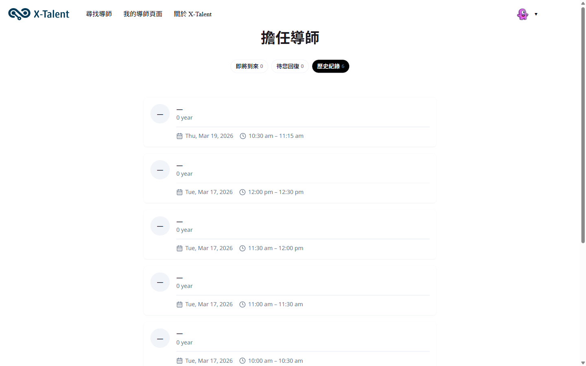 | 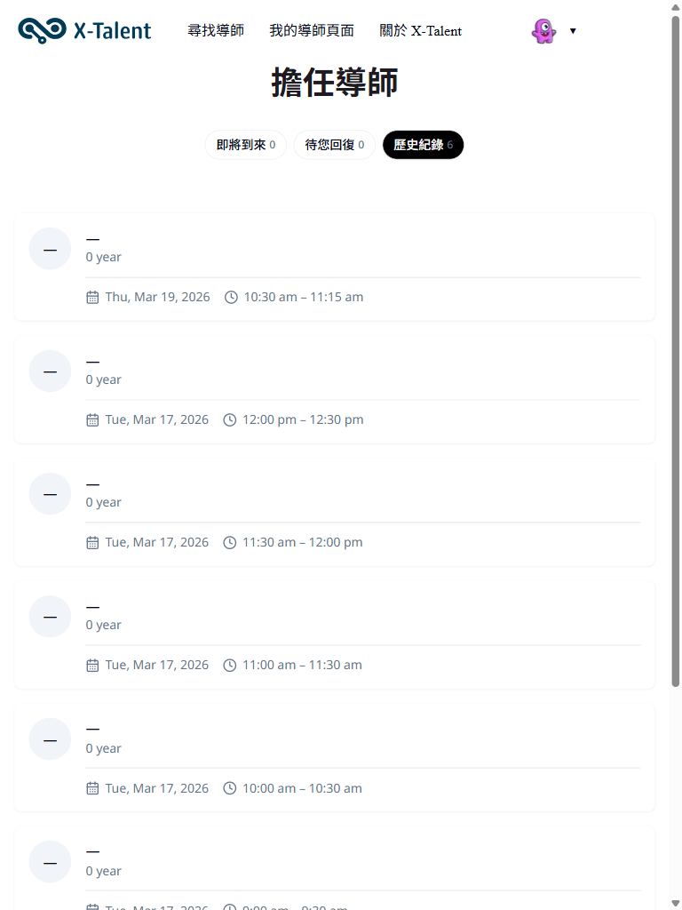 | 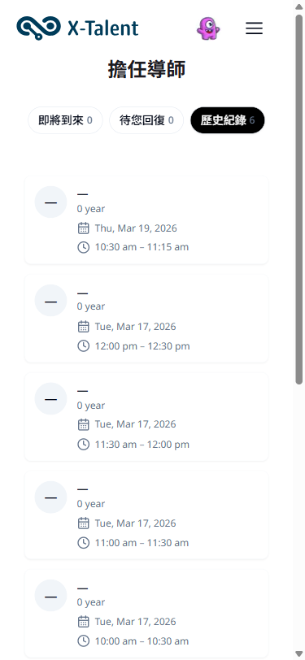 |

---

### `/reservation/mentee` 我的預約頁

### ✅ 問題 7 — Reservation Mentee 頁面 Cancel 按鈕在 Mobile Portrait (375px) 偶爾換行（已修復）

**影響頁面：** `/reservation/mentee`
**影響尺寸：** Mobile Portrait (375px)

**現象：**
時間欄位（日期 + 時段）與 Cancel 按鈕同排。當時段文字較長（如 `11:15 am – 12:00 pm`）時，Cancel 按鈕被推到下一行；較短的時段（如 `9:00 am – 9:45 am`）則可同排。導致各卡片視覺高度不一致。

| Mobile Portrait（問題）                        | Tablet Portrait（正常）                        |
| ---------------------------------------------- | ---------------------------------------------- |
| 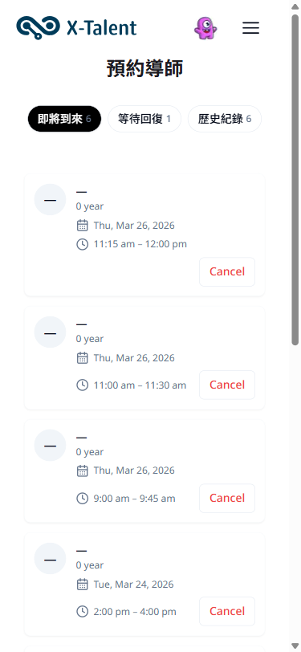 | 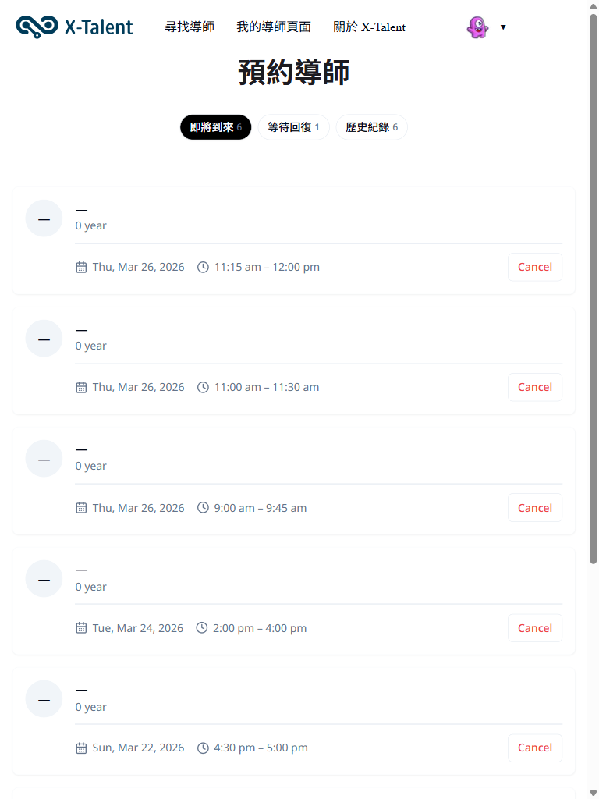 |

| Desktop 1440px                                  | Tablet Landscape 1024px                                  | Mobile Landscape 812px                                   |
| ----------------------------------------------- | -------------------------------------------------------- | -------------------------------------------------------- |
| 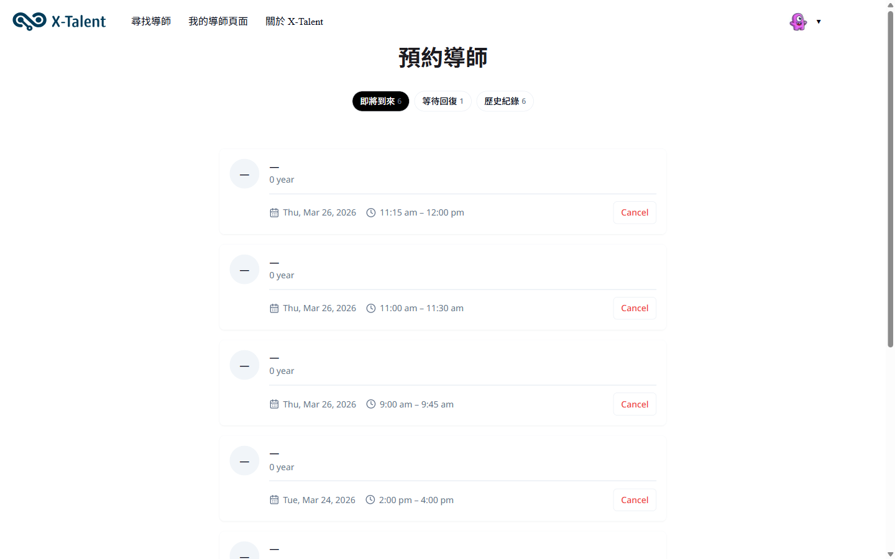 | 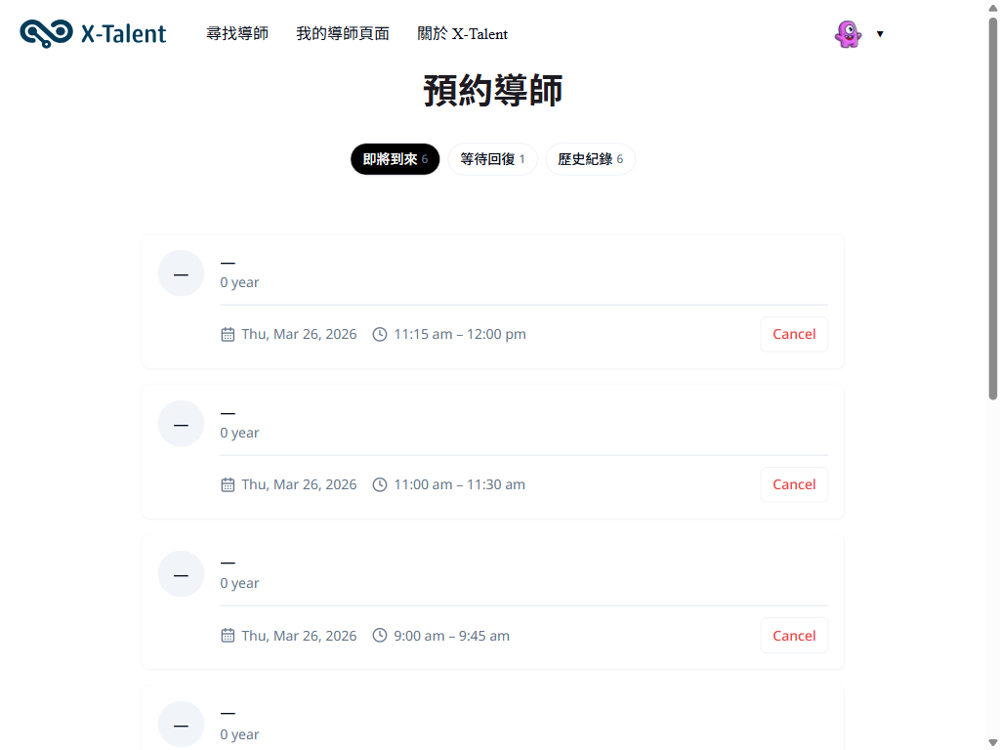 | 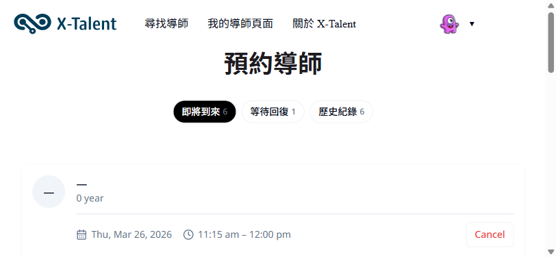 |

**修復方式：**
將 actions 從日期/時段列移到名稱/角色列的右側（`justify-between` row），讓 Cancel 按鈕永遠固定在卡片右上角，不受日期/時段文字長短影響。

**修改檔案：**

- `src/components/reservation/ReservationCard.tsx`
  - 在名稱/角色 row 內加 `<div className="shrink-0">{actions}</div>`
  - 從日期/時段 row 移除原本的 `<div className="ml-auto shrink-0">{actions}</div>`

---

## 未完成的測試項目

| 項目                        | 狀態                                                              |
| --------------------------- | ----------------------------------------------------------------- |
| Dashboard（如有）           | ⏳ 未發現此頁面入口                                               |
| Mentee 角色登入後差異       | ⏳ 需切換帳號測試                                                 |
| `/auth/onboarding` 實際渲染 | ⏳ 測試帳號已完成 onboarding，自動重導至首頁；代碼審查無 RWD 問題 |

---

## 問題修復狀態

| 優先 | 問題                                               |        狀態         | 修復方式                                                                                | 修改檔案                                       |
| ---- | -------------------------------------------------- | :-----------------: | --------------------------------------------------------------------------------------- | ---------------------------------------------- |
| 🔴 1 | Mentor Pool Filter 溢出 + options 被 header 蓋住   |      ✅ 已修復      | `flex flex-col` + `overflow-y-auto` selects + sticky buttons；`z-[55]` / `z-[60]`       | `MentorFilterDropdown.tsx`、`FilterSelect.tsx` |
| 🔴 2 | Auth 頁面大量空白（Tablet/Mobile）                 |      ✅ 已修復      | 移除 `min-h-[calc(100vh-70px)]`，保留 `lg:min-h-[720px]`                                | `auth/(sign)/layout.tsx`                       |
| 🟡 3 | About 1024px 文字無邊距                            |      ✅ 已修復      | 移除 `lg:px-0`，保留所有尺寸 `px-8`                                                     | `about/page.tsx`                               |
| 🟡 4 | 首頁 Testimonial 1024px 截斷                       |      ✅ 已修復      | `flex-initial` → `flex-1 min-w-0`                                                       | `HomePageSlider.tsx`                           |
| 🟡 5 | 漢堡選單 / Account Sheet — SheetTitle 缺失         |      ✅ 已修復      | 各自加 `<SheetTitle className="sr-only">`                                               | `HamburgerMenu.tsx`、`MobileUserMenu.tsx`      |
| 🟡 6 | Profile 頁面 375px 用戶名水平溢出                  |      ✅ 已修復      | 容器加 `min-w-0`，名稱加 `break-words`                                                  | `profile/[pageUserId]/ui.tsx`                  |
| 🟡 7 | Reservation Mentee 375px Cancel 按鈕換行           |      ✅ 已修復      | actions 移至名稱列右側，固定不隨日期文字換行                                            | `ReservationCard.tsx`                          |
| 🟡 8 | Email Verify 頁面 375px 文字因 `p-20` 過窄嚴重換行 | ✅ 已修復（第二輪） | `p-20` → `px-6 pb-8 pt-16 md:p-20`（保持 icon 不重疊；`md:` 以上維持原本 80px padding） | `auth/email-verify/ui.tsx`                     |

---

## 第二輪驗收（C 方案）— 截圖

> **測試日期：** 2026-03-20
> **測試尺寸：** 375px / 768px / 1024px / 1440px

### 原始 7 個問題重驗結果

| #   | 問題                    | 375px | 768px | 1024px | 1440px |
| --- | ----------------------- | :---: | :---: | :----: | :----: |
| 1   | Mentor Pool Filter 溢出 |  ✅   |  ✅   |   ✅   |   ✅   |
| 2   | Auth 大量空白           |  ✅   |  ✅   |   ✅   |   ✅   |
| 3   | About 文字無邊距        |  ✅   |  ✅   |   ✅   |   ✅   |
| 4   | 首頁 Testimonial 截斷   |  ✅   |  ✅   |   ✅   |   ✅   |
| 5   | SheetTitle 缺失         |  ✅   |  ✅   |   ✅   |   ✅   |
| 6   | Profile 用戶名溢出      |  ✅   |  ✅   |   ✅   |   ✅   |
| 7   | Reservation Cancel 換行 |  ✅   |  ✅   |   ✅   |   ✅   |

#### 問題 1 — Mentor Pool Filter 驗收截圖

| Filter 375px（可捲動+按鈕固定）                | Filter 1440px（可捲動+按鈕固定）                |
| ---------------------------------------------- | ----------------------------------------------- |
| 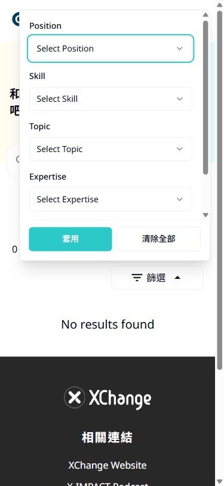 | 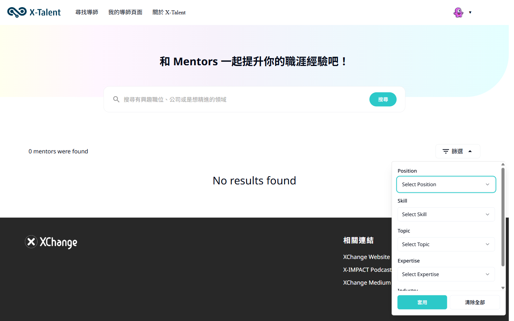 |

#### 問題 2 — SignIn 無大量空白 驗收截圖

| SignIn 375px                       | SignIn 768px                       |
| ---------------------------------- | ---------------------------------- |
| 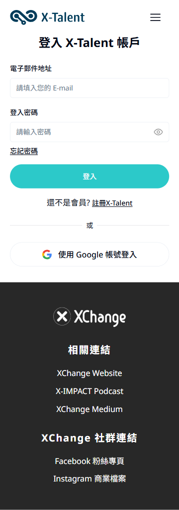 |  |

#### 問題 6 — Profile 用戶名 375px 驗收截圖

| Profile 375px（無溢出）             |
| ----------------------------------- |
| 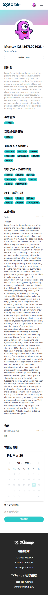 |

#### 問題 7 — Reservation Mentee Cancel 按鈕 375px 驗收截圖

| Reservation Mentee 375px（Cancel 固定右上）    |
| ---------------------------------------------- |
| 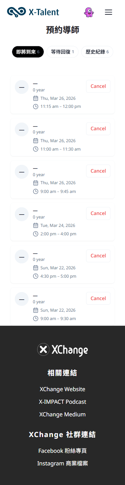 |

---

### 新增頁面測試結果

#### `/auth/password-forgot` — 各斷點

| 375px                                       | 768px                                       | 1024px                                       | 1440px                                       |
| ------------------------------------------- | ------------------------------------------- | -------------------------------------------- | -------------------------------------------- |
| 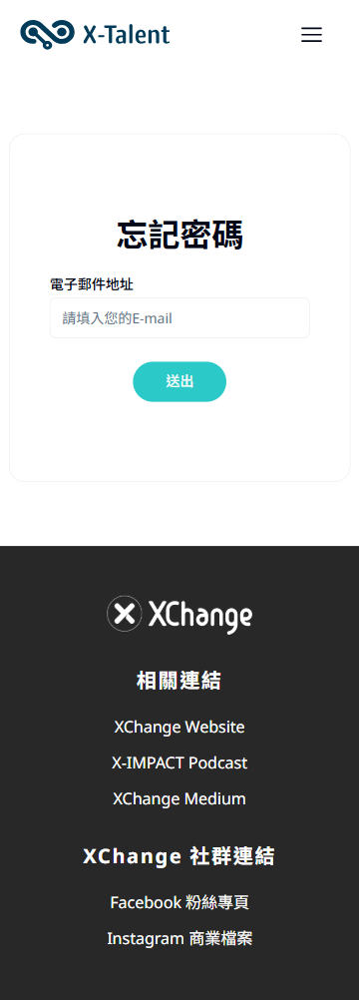 | 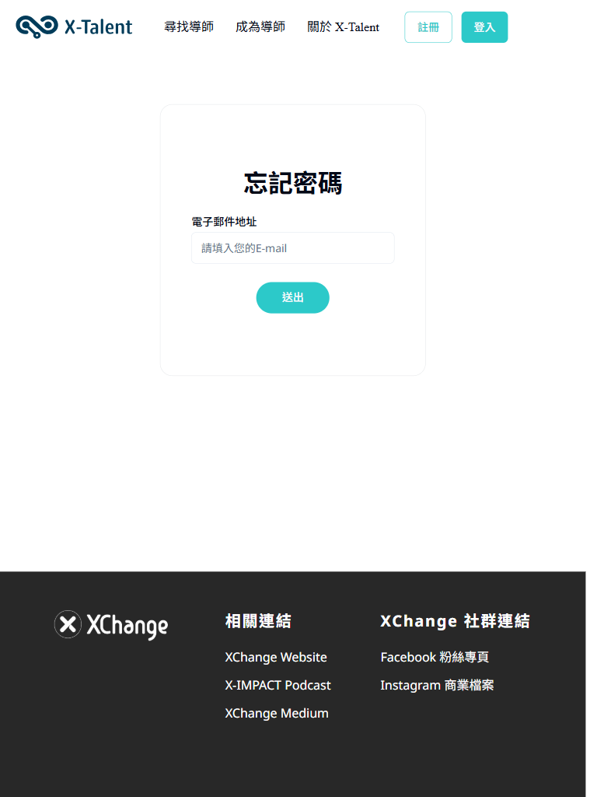 | 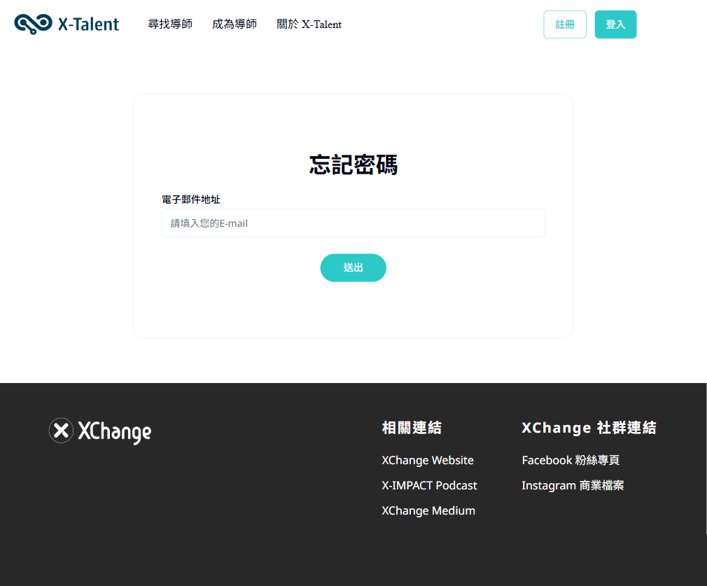 | 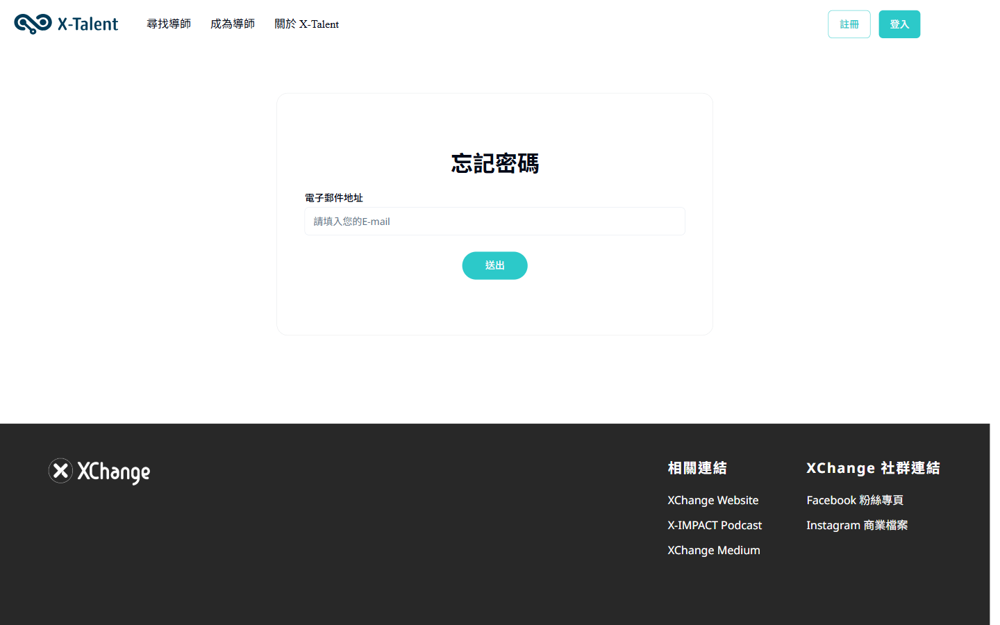 |

**結論：** 各斷點正常，卡片居中，無 RWD 問題。

---

#### `/auth/email-verify` — 新發現問題 8 + 修復

**問題描述：**
`email-verify` 頁面的內容區塊使用 `p-20`（80px 四邊 padding）。在 375px 裝置上，卡片寬度 = `90% × 375 = 337px`，內容寬度 = `337 - 160 = 177px`，導致說明文字嚴重換行，同時也與 icon 定位重疊（icon 向下偏移 53px，`p-6` top padding 不足）。

**修復方式（`src/app/auth/email-verify/ui.tsx`）：**

```diff
- <div className="flex flex-col items-center gap-6 p-20 text-center">
+ <div className="flex flex-col items-center gap-6 px-6 pb-8 pt-16 text-center md:p-20">
```

- `px-6`：水平 padding 減至 24px，內容寬 289px，文字正常換行
- `pt-16`：頂部 padding 64px，確保 icon（偏移 53px）不與標題重疊
- `pb-8`：底部 padding 32px
- `md:p-20`：768px 以上恢復原本 80px padding（卡片最大寬 630px，空間充足）

| 問題（375px 原始）                       | 修復後（375px）                                 | 768px 確認無回退                               |
| ---------------------------------------- | ----------------------------------------------- | ---------------------------------------------- |
| 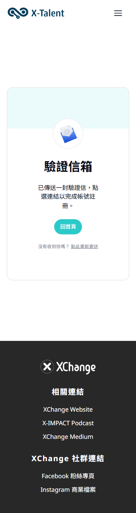 | 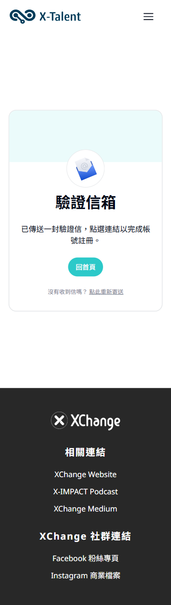 | 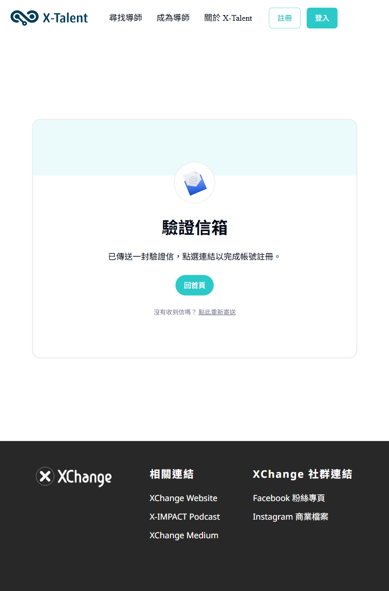 |

其他斷點截圖（無問題）：

| 1024px                                    | 1440px                                    |
| ----------------------------------------- | ----------------------------------------- |
| 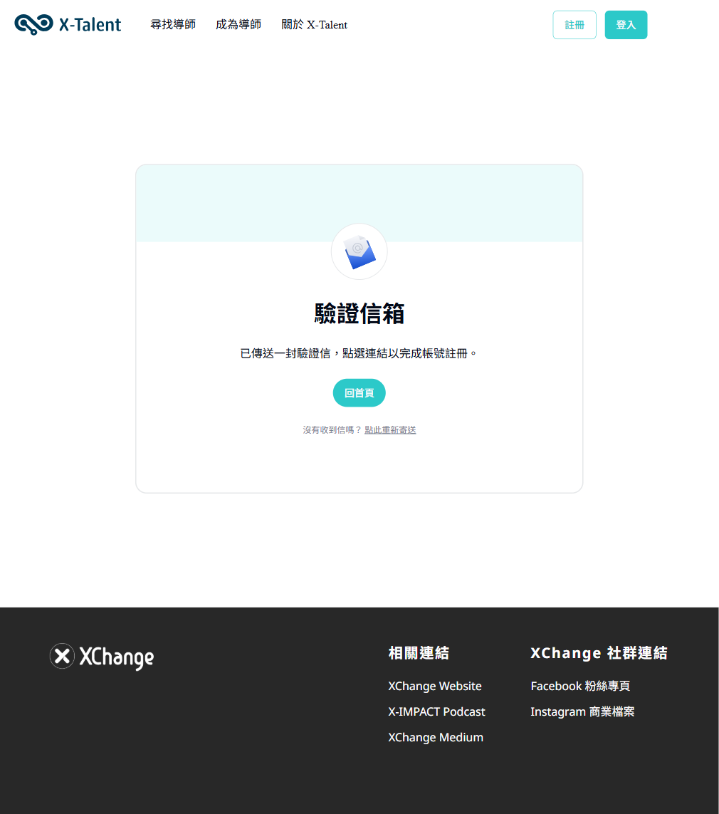 | 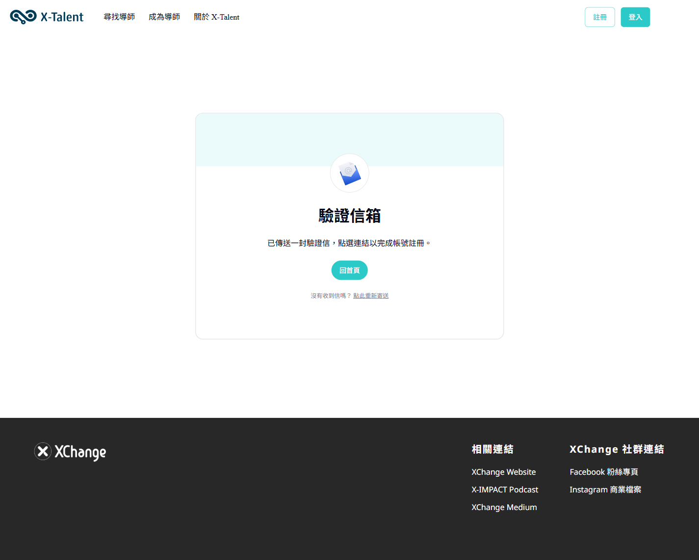 |

---

#### `/auth/onboarding` — 代碼審查

**狀態：** 測試帳號（`onBoarding = true`）訪問此頁面時，`(sign)` layout 會將其重導至 `/`，無法直接渲染。

**代碼審查結論：**

- 容器：`<div className="mx-auto max-w-[600px] px-5 py-20">` — `px-5`（20px）提供充足 mobile 邊距，`max-w-[600px]` 限制桌面寬度
- `(sign)` layout 在 mobile 自動隱藏右欄圖片，左欄佔全寬
- 步驟標題 `text-4xl font-bold` 在 375px 有充足空間
- **結論：無 RWD 問題**

---

#### `/profile/[pageUserId]/edit` — 各斷點

| 375px                                    | 768px                                    | 1024px                                    | 1440px                                    |
| ---------------------------------------- | ---------------------------------------- | ----------------------------------------- | ----------------------------------------- |
| 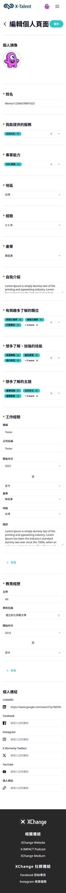 | 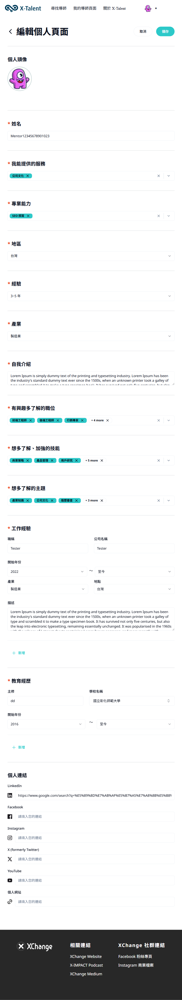 | 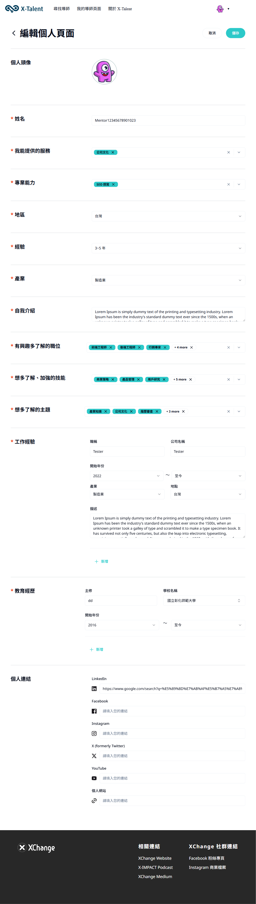 | 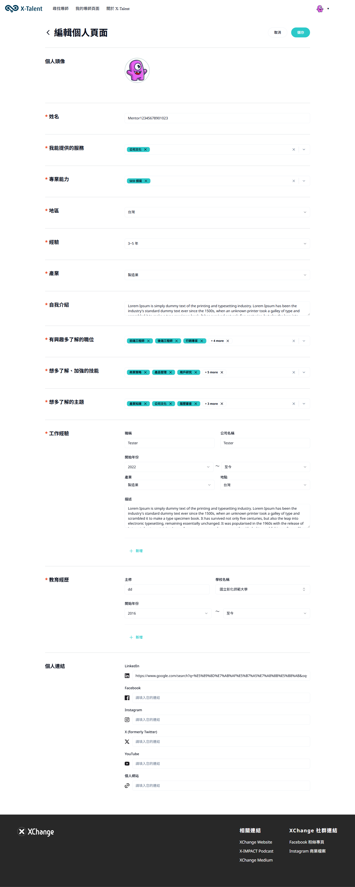 |

**結論：** 各斷點表單佈局正常：

- 375px：標籤在欄位上方，表單單欄，header「取消/儲存」按鈕可見
- 768px：同 375px 但更寬，多欄標籤排列正常
- 1024px / 1440px：雙欄標籤 + 欄位排列整齊
- 無水平溢出，無截斷問題
